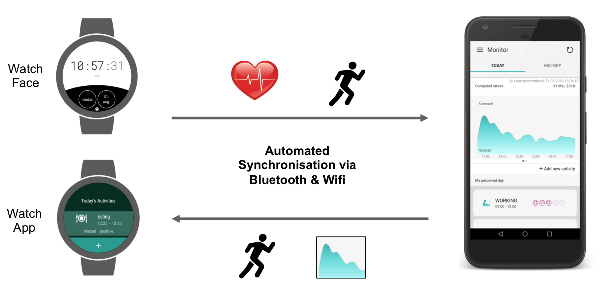
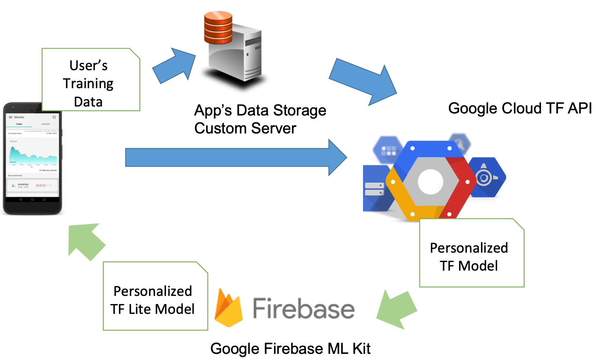
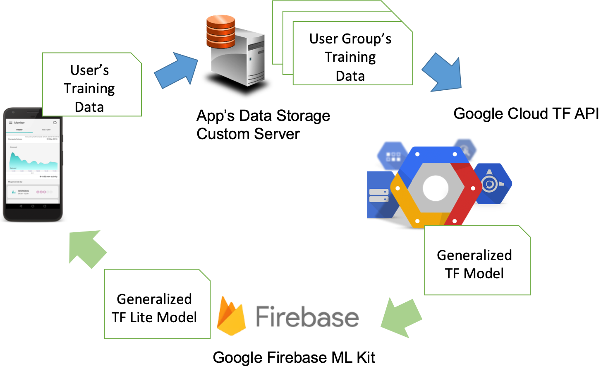

# Android App: Instant Stress Detection through Estimation of Heart Rate Variability  

## 1. Project Idea

In our everyday life it is a common issue to be exposed to extreme stress.
 A handheld mobile **app for instant stress detection**, using a heart rate sensor of a smartwatch that continuously monitors physiological body response to stressors, can help us better understand our own life circumstances and, ideally, trigger behavior changes which will result in a healthier life. 

Such an app using smartwatches for passive sensing is easier to use than the common medical devices. Users only need to give a short report on their personal perceptions of stress levels during their stressful life events, so that the system can learn from this individual experience and then provide useful suggestions.

[Heart rate variability](https://www.escardio.org/static_file/Escardio/Guidelines/Scientific-Statements/guidelines-Heart-Rate-Variability-FT-1996.pdf) (HRV) is a good indication of how much stress the body is exposed to. It is, however, still challenging to build a HRV based stress detection model:
* Depending on personal circumstances such as body weight, age, or experiences, each individual may have different physiological responses to the stressors. 

The On-Device Machine Learning with TensorFlow Lite may provide solid solutions to the aforementioned issue:
* During the handheld device charging time, an individual model for stress detection based on the past data samples can be downloaded from a ML service backend and be converted to a TensorFlow lite model for the inference of future life events.

The realization of this suggested app may not only help gain insight into individual biofeedback such as stress, but also contribute to find the underlying relationship between body and mind. It helps push medical innovation through technology.

## 2. Overview of the App's Concept Design



The suggested stress detection app comprises two app components:
* **Wear OS smartwatch app**, which continuously measures its user's heart rates and synchronises heart rate data and the user's stress self-reports with the handheld mobile app.
* **handheld mobile app**, which silently fetches personalized TensorFlow lite (.tflite) stress detection model and predicts the user's stress with a sequence of heart rate data as input to the inference model. Handheld mobile app shall also collect the user's perceived stress level through a self-report, so that a TensorFlow model can be trained in a backend service or a TensorFlow Cloud Service. 

## 3. Approaches of How On-Device Machine Learning can help

### Approach 1: Personalized TF Model training and deployment for the inference



To build an individual stress detection model with TensorFlow: 
* an app user's training data can be **either** directly uploaded to [Google Cloud TF API](https://cloud.google.com/ml-engine/docs/custom-containers) **or** through a data storage custom server.
* Google Cloud TF API will train a personalized TF Model and upload it to the Google Firebase to host the custom TF model for this particular user.
* Through [Firebase ML Kit](https://firebase.google.com/docs/ml-kit/android/use-custom-models), the converted user's personalized TF Lite Model is silently pushed back to the particular user's android app. This app will then do the inference with this up-to-date stress detection model.

### Approach 2: General TF Model training with personalization bits and deployment 



To build a generalized stress detection model (with personalization bits in the input vector) over a large population with TensorFlow: 
* an app user's training data will be uploaded to a data storage custom server.
* The data storage custom server will then periodically push all users' training data to  [Google Cloud TF API](https://cloud.google.com/ml-engine/docs/custom-containers).
* Google Cloud TF API can then train a generalized TF Model (with personalization bits so that the model can catch up each user's individual traits) and upload this generalized TF model to the Google Firebase to host the custom TF model for all app users.
* Through [Firebase ML Kit](https://firebase.google.com/docs/ml-kit/android/use-custom-models), the converted Generalized Stress Detection TF Lite Model is silently pushed back to all users' android apps. The apps will then do the inference with this up-to-date generalized stress detection model. 

## 4. Access of the Current Template Implementation

The current template implementation with statical hard coded baseline model for stress detection is deployed as public beta app in Google Play (https://play.google.com/store/apps/details?id=lmu.pms.stila). 

## 5. Encouraging user feedbacks (on current app template with statical model and without On-Device ML)
```
It actually helped me avoid two epileptic seizures.
```

```
It made me more self aware.
```

```
I was able to rely on its suggestion that I was stressed at times I did not realise.
```
In a [user survey in 2018](http://stila.pms.ifi.lmu.de/news.html), users of the [current app template](https://play.google.com/store/apps/details?id=lmu.pms.stila&pcampaignid=MKT-Other-global-all-co-prtnr-py-PartBadge-Mar2515-1) with only a [statical baseline model](https://ieeexplore.ieee.org/document/8730850) had provided encouraging feedbacks on how this app idea helped them. It is conceivable that a personalized and on-device ML model for stress detection will provide users with even more precise information on their stress development and help them be more aware of their stress development and life style.     

